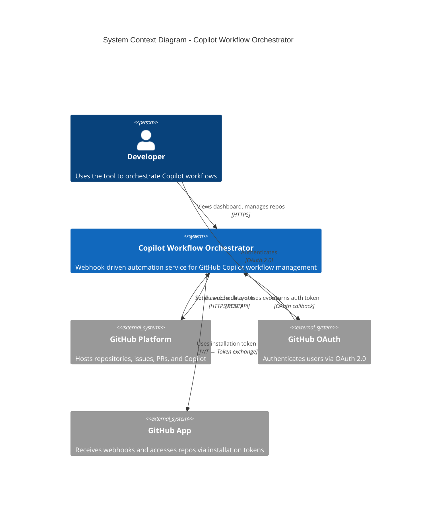
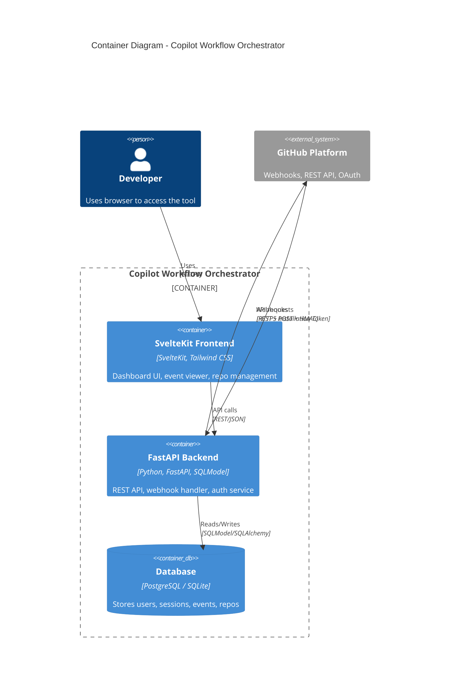
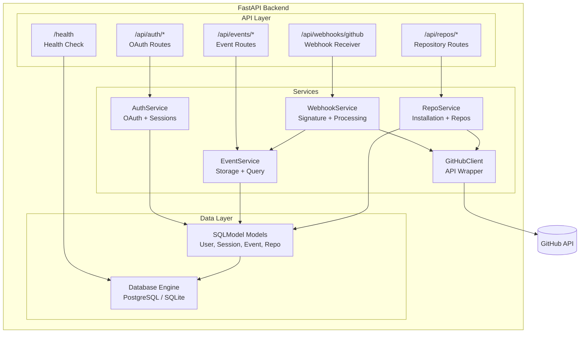
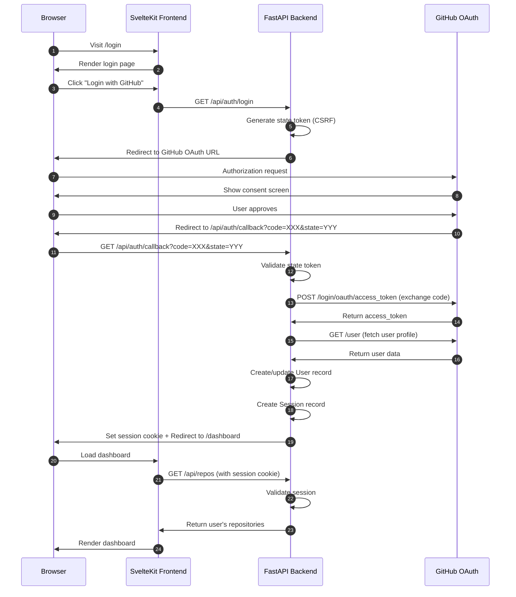
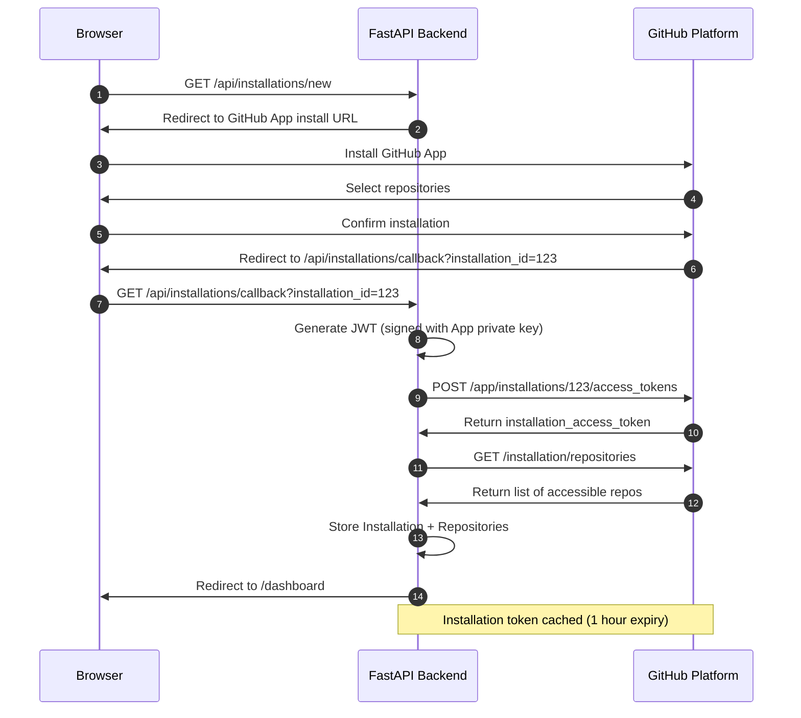
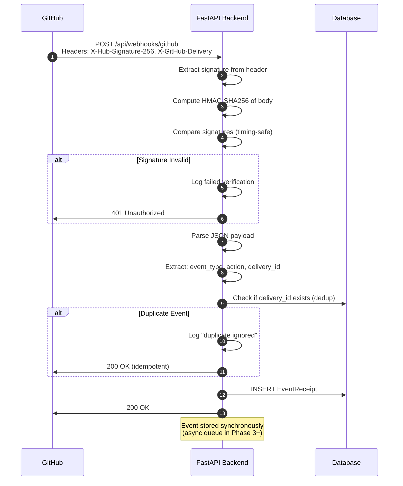
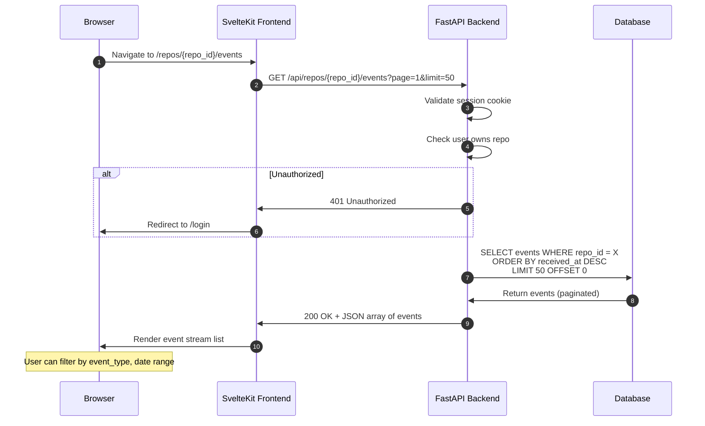
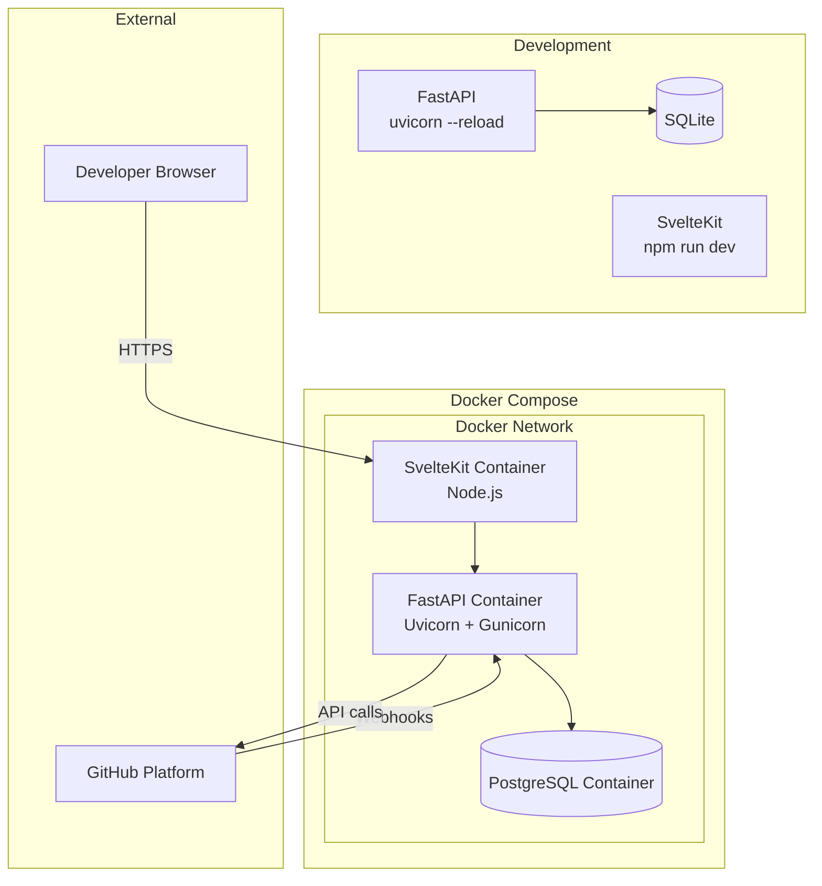
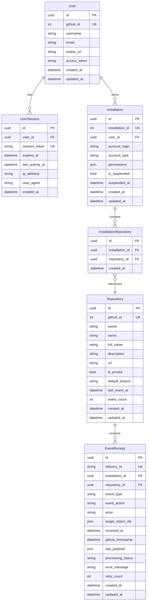

# Phase 1 System Diagrams

**Agent:** @arch-spec-author

**Date:** January 18, 2026

______________________________________________________________________

## 1. C4 Context Diagram

Shows the system in its environment with external actors and systems.

______________________________________________________________________

## 2. C4 Container Diagram

Shows the high-level technical building blocks.

______________________________________________________________________

## 3. Component Diagram (Backend)

Shows the internal structure of the FastAPI backend.

______________________________________________________________________

## 4. Sequence Diagram: OAuth Login Flow

______________________________________________________________________

## 5. Sequence Diagram: GitHub App Installation

______________________________________________________________________

## 6. Sequence Diagram: Webhook Reception

______________________________________________________________________

## 7. Sequence Diagram: Event Stream Query

______________________________________________________________________

## 8. Deployment Diagram

______________________________________________________________________

## 9. Entity Relationship Diagram

______________________________________________________________________

**Diagrams generated by:** @arch-spec-author agent
