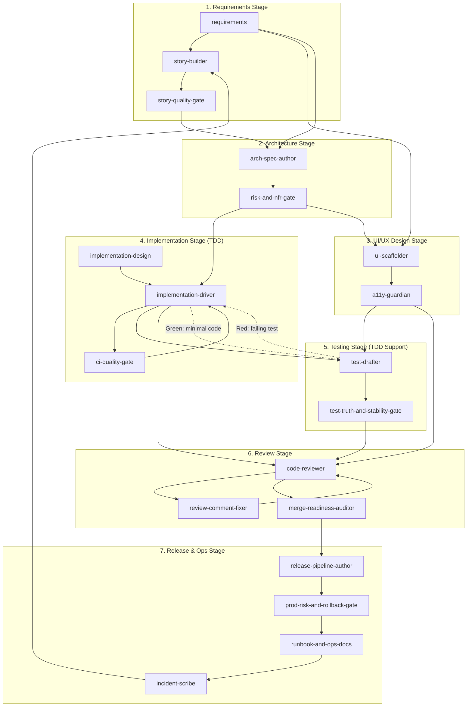

# Custom Agent Workflow Diagram

This document describes the complete workflow of custom GitHub Copilot agents across the software development lifecycle.

______________________________________________________________________

## Agent Inventory

| #  | Agent                              | Type    | Lifecycle Stage      |
|----|------------------------------------|---------|--------------------|
| 1  | `requirements`                     | Builder | 1. Requirements    |
| 2  | `story-builder`                    | Builder | 1. Requirements    |
| 3  | `story-quality-gate`               | Gate    | 1. Requirements    |
| 4  | `ui-scaffolder`                    | Builder | 2. UI/UX Design    |
| 5  | `a11y-guardian`                    | Gate    | 2. UI/UX Design    |
| 6  | `arch-spec-author`                 | Builder | 3. Architecture    |
| 7  | `risk-and-nfr-gate`                | Gate    | 3. Architecture    |
| 8  | `implementation-design`            | Builder | 4. Implementation  |
| 9  | `implementation-driver`            | Builder | 4. Implementation  |
| 10 | `ci-quality-gate`                  | Gate    | 4. Implementation  |
| 11 | `test-drafter`                     | Builder | 5. Testing         |
| 12 | `test-truth-and-stability-gate`    | Gate    | 5. Testing         |
| 13 | `code-reviewer`                    | Gate    | 6. Review          |
| 14 | `review-comment-fixer`             | Builder | 6. Review          |
| 15 | `merge-readiness-auditor`          | Gate    | 6. Review          |
| 16 | `release-pipeline-author`          | Builder | 7. Release & Ops   |
| 17 | `prod-risk-and-rollback-gate`      | Gate    | 7. Release & Ops   |
| 18 | `runbook-and-ops-docs`             | Builder | 7. Release & Ops   |
| 19 | `incident-scribe`                  | Builder | 7. Release & Ops   |

______________________________________________________________________

## Complete Workflow Diagram

```
┌─────────────────────────────────────────────────────────────────────────────┐
│                        SDLC AGENT WORKFLOW                                  │
└─────────────────────────────────────────────────────────────────────────────┘

1. REQUIREMENTS STAGE
   requirements ──┬──> story-builder ──> story-quality-gate ──┐
                  ├──> ui-scaffolder                          │
                  └──> arch-spec-author <─────────────────────┘

   📥 INPUTS:
   • Raw ideas, stakeholder requests, or problem statements
   • Business goals and success criteria
   • Existing documentation and domain context
   • Constraints (time, budget, compliance, platform)

   📤 OUTPUTS:
   • Feature one-pagers with problem statements and success metrics
   • INVEST-compliant user stories with acceptance criteria (Given/When/Then)
   • Risk register and non-functional requirements (NFRs)
   • Definition of Ready (DoR) validated backlog items

   📋 ISSUE TEMPLATES:
   • `01-feature-request.yml` ← Feature one-pagers
   • `02-user-story.yml` ← User stories with DoR checklist

2. ARCHITECTURE STAGE
   arch-spec-author ──> risk-and-nfr-gate ──┬──> implementation-driver
                                            └──> ui-scaffolder

   📥 INPUTS:
   • Feature one-pagers and validated user stories (from Requirements)
   • Acceptance criteria and NFRs (from Requirements)
   • Risk register (from Requirements)
   • Existing codebase patterns and conventions

   📤 OUTPUTS:
   • Architecture brief (context, goals, constraints, quality attributes)
   • API contracts (OpenAPI/JSON Schema) with error models
   • Data models and migration strategies
   • Mermaid/C4 diagrams (context, container, sequence)
   • Architecture Decision Records (ADRs)
   • Threat model and security review

   📋 ISSUE TEMPLATES:
   • `04-architecture-decision.yml` ← ADRs
   • `05-technical-debt.yml` ← Tech debt tracking

3. UI/UX DESIGN STAGE
   ui-scaffolder ──> a11y-guardian ──┬──> test-drafter
                                     └──> code-reviewer

   📥 INPUTS:
   • API contracts and data models (from Architecture)
   • User stories with UI-related acceptance criteria (from Requirements)
   • Design specs, wireframes, or mockups (external)
   • Existing design system and component library

   📤 OUTPUTS:
   • UI contract (routes, components, states, responsive requirements)
   • Component scaffolds (React/TS) with loading/empty/error states
   • Typed mock data and fixtures
   • Storybook stories for all component states
   • Accessibility audit report (WCAG compliance)

4. IMPLEMENTATION STAGE
   implementation-driver ──┬──> test-drafter
                           ├──> ci-quality-gate (on failures)
                           └──> code-reviewer

   📥 INPUTS:
   • API contracts and data models (from Architecture)
   • ADRs and architecture diagrams (from Architecture)
   • UI scaffolds and component contracts (from UI/UX Design)
   • User stories with acceptance criteria (from Requirements)
   • **Failing tests from TDD Red phase** (from Testing)

   📤 OUTPUTS:
   • Production code changes (small, focused commits)
   • Implementation following contracts/specs
   • Error handling and validation logic
   • Logging and observability hooks
   • PR-ready branches with clear descriptions
   • **Tests passing (TDD Green phase)**

   🔄 TDD LOOP (Red → Green → Refactor):
   • test-drafter writes failing test (Red)
   • implementation-driver implements minimal code (Green)
   • implementation-driver refactors while tests stay green
   • Repeat for each behavior

5. TESTING STAGE (Supports TDD Red Phase)
   test-drafter ──> test-truth-and-stability-gate ──> code-reviewer

   📥 INPUTS:
   • Acceptance criteria and edge cases (from Requirements) — **tests written first**
   • API contracts for contract testing (from Architecture)
   • UI components and states (from UI/UX Design)
   • Production code changes (from Implementation) — **for validation in Green phase**

   📤 OUTPUTS:
   • Unit tests for business logic (≥95% coverage for core modules)
   • Smoke tests for critical path checks
   • Integration tests for API contracts and DB boundaries
   • E2E tests for critical user paths (keep small)
   • Deterministic fixtures and test data
   • Coverage reports mapped to acceptance criteria

   � ISSUE TEMPLATES:
   • `06-test-case-gap.yml` ← Missing test coverage

   �🔄 TDD INTEGRATION (Bidirectional with Implementation):
   • Tests written BEFORE implementation (Red phase) — test-drafter initiates
   • Tests follow AAA structure (Arrange → Act → Assert)
   • Behavior over implementation testing
   • Test pyramid: many unit, some integration, few E2E
   • After Green phase, test-drafter may add edge cases and coverage

6. REVIEW STAGE
   code-reviewer ──> review-comment-fixer ──> merge-readiness-auditor
                                                      │
   📥 INPUTS:                                         │
   • PR with code changes (from Implementation)       │
   • Test suite and coverage reports (from Testing)   │
   • Architecture specs for contract verification (from Architecture)
   • User stories for acceptance validation (from Requirements)
                                                      │
   📤 OUTPUTS:                                        │
   • Pre-review report (security, performance, quality, design)
   • Review comment fixes with minimal diffs
   • Merge readiness report (CI status, approvals, conversations)
   • Approved PR ready for merge
                                                      │
7. RELEASE & OPS STAGE                                ▼
   release-pipeline-author <──────────────────────────┘
          │
          ├──> prod-risk-and-rollback-gate
          │           │
          │           └──> runbook-and-ops-docs
          │                       │
          │                       └──> incident-scribe (on incidents)
          │                                   │
          └───────────────────────────────────┴──> story-builder (follow-ups)

   📥 INPUTS:
   • Approved and merged PR (from Review)
   • Architecture specs for deployment context (from Architecture)
   • NFRs for SLO/monitoring requirements (from Requirements)
   • Risk register for rollback planning (from Requirements/Architecture)

   📤 OUTPUTS:
   • GitHub Actions workflows (build, test, deploy)
   • Environment configurations with approval gates
   • Release plan with rollback triggers
   • Risk assessment report (blast radius, irreversible actions)
   • Deployment runbooks with copy-pasteable commands
   • On-call notes and troubleshooting guides
   • Incident timelines and postmortem documents (when needed)

   📋 ISSUE TEMPLATES:
   • `07-release-request.yml` ← Release requests with rollback plan
   • `08-incident-report.yml` ← Post-incident reports
```

______________________________________________________________________

## Issue Template to Agent Mapping

Agents output content compatible with GitHub Issue Forms in `.github/ISSUE_TEMPLATE/`:

| Issue Template | Primary Agent | Gate Agent | Lifecycle Stage |
|----------------|---------------|------------|-----------------|
| `01-feature-request.yml` | `requirements` | — | Requirements |
| `02-user-story.yml` | `story-builder` | `story-quality-gate` | Requirements |
| `03-bug-report.yml` | `implementation-driver` | `code-reviewer` | Implementation |
| `04-architecture-decision.yml` | `arch-spec-author` | `risk-and-nfr-gate` | Architecture |
| `05-technical-debt.yml` | `arch-spec-author` | `risk-and-nfr-gate` | Architecture |
| `06-test-case-gap.yml` | `test-drafter` | `test-truth-and-stability-gate` | Testing |
| `07-release-request.yml` | `release-pipeline-author` | `prod-risk-and-rollback-gate` | Release & Ops |
| `08-incident-report.yml` | `incident-scribe` | — | Release & Ops |

### Workflow: Agent Output → Issue Creation

```
┌─────────────────────────────────────────────────────────────────────────────┐
│                    AGENT TO ISSUE WORKFLOW                                  │
└─────────────────────────────────────────────────────────────────────────────┘

  Agent Drafting (VS Code Chat)          Issue Persistence (GitHub)
  ─────────────────────────────          ─────────────────────────────

  @requirements                          ┌─────────────────────────┐
       │                                 │  01-feature-request.yml │
       │ handoff                         └─────────────────────────┘
       ▼                                           ▲
  @story-builder ──────────────────────────────────┼── copy/paste or
       │                                           │   MCP tool
       │ handoff                         ┌─────────────────────────┐
       ▼                                 │  02-user-story.yml      │
  @story-quality-gate                    └─────────────────────────┘
       │                                           ▲
       │ validated output ─────────────────────────┘
       ▼
  Ready for backlog entry

  Options for issue creation:
  1. Manual: Copy agent output → Paste into GitHub Issue Form
  2. Prompt: Use /story-to-issue-form to format output
  3. MCP: Agent calls GitHub API to create issue directly
```

______________________________________________________________________

## Mermaid Diagram



______________________________________________________________________

## Iterative Loops

The workflow supports iteration at multiple points:

| Loop                | Trigger                     | Flow                                                           |
|---------------------|-----------------------------|----------------------------------------------------------------|
| Story Refinement    | Quality issues found        | `story-quality-gate` → `story-builder`                        |
| Architecture Update | Risk/NFR gaps               | `risk-and-nfr-gate` → `arch-spec-author`                     |
| Accessibility Fix   | A11y audit fails            | `a11y-guardian` → `ui-scaffolder`                            |
| **TDD Red→Green**   | **Each behavior change**    | `test-drafter` → `implementation-driver` → `test-drafter`    |
| Test Revision       | Low signal tests            | `test-truth-and-stability-gate` → `test-drafter`             |
| Review Fix          | Comments to address         | `code-reviewer` → `review-comment-fixer` → `code-reviewer`   |
| Incident Follow-up  | Post-incident actions       | `incident-scribe` → `story-builder`                          |

### TDD Loop Detail (Red → Green → Refactor)

> **Note on Stage Ordering**: While the lifecycle stages are numbered sequentially (4. Implementation, 5. Testing), TDD requires **tests to drive implementation**. The `test-drafter` and `implementation-driver` agents work in a tight loop across stages 4-5, with tests written first (Red), then code (Green), then improvement (Refactor).

```
┌─────────────────────────────────────────────────────────────┐
│                    TDD CYCLE                                │
│                                                             │
│   ┌──────────┐    ┌──────────┐    ┌──────────┐              │
│   │   RED    │───>│  GREEN   │───>│ REFACTOR │──┐           │
│   │  (test)  │    │  (code)  │    │ (improve)│  │           │
│   └──────────┘    └──────────┘    └──────────┘  │           │
│        ^                                        │           │
│        └────────────────────────────────────────┘           │
│                                                             │
│   Agents:                                                   │
│   • RED: test-drafter writes failing test                   │
│   • GREEN: implementation-driver writes minimal code        │
│   • REFACTOR: implementation-driver improves structure      │
│   • Gate: test-truth-and-stability-gate validates tests     │
└─────────────────────────────────────────────────────────────┘
```

______________________________________________________________________

## Stage Entry Points

Different scenarios have different entry points:

| Scenario                    | Start Agent                         | Path               |
|-----------------------------|------------------------------------|-------------------|
| New feature from idea       | `requirements`                      | Full lifecycle    |
| Design-ready feature        | `ui-scaffolder` or `arch-spec-author` | Skip requirements |
| **TDD-driven feature**      | `test-drafter`                      | Red → Green → Refactor loop with `implementation-driver` |
| Bug fix                     | `test-drafter` (write failing test first) | TDD path: Red → Green |
| Test coverage improvement   | `test-drafter`                      | Testing only      |
| Hotfix/emergency            | `implementation-driver` → `code-reviewer` | Fast path (add tests after) |
| Incident response           | `incident-scribe`                   | Ops path          |

______________________________________________________________________

## Agent Responsibilities Summary

### Builder Agents (Create artifacts)

- **requirements**: Feature one-pagers, acceptance criteria, risk analysis
- **story-builder**: INVEST-compliant user stories with **testable acceptance criteria**
- **ui-scaffolder**: UI components, mock data, Storybook stories
- **arch-spec-author**: API contracts, diagrams, ADRs, data models, **contract test stubs**
- **implementation-design**: Technical specs without code
- **implementation-driver**: Production code using **TDD (Red→Green→Refactor)**
- **test-drafter**: Unit, smoke, integration, and E2E tests; **supports TDD Red phase**
- **review-comment-fixer**: Implements reviewer feedback
- **release-pipeline-author**: CI/CD workflows, deployment scripts
- **runbook-and-ops-docs**: Operational documentation
- **incident-scribe**: Incident timelines, postmortems

### Gate Agents (Quality control)

- **story-quality-gate**: INVEST validation, DoR checks, **testability verification**
- **a11y-guardian**: Accessibility audits
- **risk-and-nfr-gate**: Security, threat model, NFR review
- **ci-quality-gate**: CI failure analysis and fixes; **coverage enforcement**
- **test-truth-and-stability-gate**: Test quality validation, **AAA structure, determinism checks**
- **code-reviewer**: Pre-merge code review
- **merge-readiness-auditor**: Merge criteria verification, **coverage gate**
- **prod-risk-and-rollback-gate**: Release safety review

______________________________________________________________________

## Configuration Files

The agent workflow is governed by these configuration files:

| File | Purpose | Used By |
|------|---------|---------|
| `.github/copilot-instructions.md` | Universal rules (INVEST, DoR, output format) | VS Code Chat, Coding Agent |
| `.github/instructions/issue-output.instructions.md` | Issue-specific output formatting | VS Code Chat, Coding Agent |
| `.github/prompts/story-to-issue-form.prompt.md` | Interactive `/story-to-issue-form` command | VS Code Chat |
| `.github/ISSUE_TEMPLATE/*.yml` | Structured issue intake forms | GitHub Issues |
| `.github/agents/*.agent.md` | Agent definitions with handoffs | VS Code Chat |
